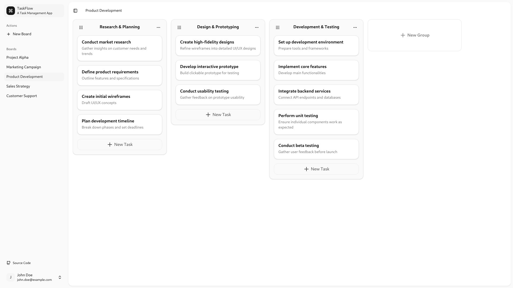

## Overview - TaskFlow - A Task Management App

**TaskFlow** is a lightweight task management web application that allows users to create, organize, and track tasks in an intuitive kanban-style interface.

<a href="https://taskflow-demo.netlify.app" target="_blank">Try Demo</a>

### Features

- **Google Authentication** - Users can sign up and log in using their Google accounts.
- **Boards Management** - Create, update, and delete boards.
- **Groups Management** - Add, edit, move, and delete groups within a board.
- **Tasks Management** - Create, update, move, and delete tasks within groups.
- **Drag-and-Drop** - Implement drag-and-drop functionality for seamless task movement.

### Tech Stack

- **Frontend**: TypeScript, React, Taildwind, Zustand
- **Backend**: Java, Spring Boot, Spring Web/Security/Data JPA
- **Database**: PostgreSQL

### Motivation

This Task Management app was built as a personal project to enhance my skills in both frontend and backend development. By using React and TypeScript for the frontend, and Java with Spring Boot for the backend, I aimed to gain hands-on experience in developing a full-stack application.

Inspired by platforms like Trello, this app allows users to manage tasks effectively through a Kanban-style board. The project also serves as a practical addition to my self-taught Software Engineer portfolio, demonstrating my ability to design, implement, and deploy scalable applications while integrating authentication and state management.

## Architecture Overview

Provide a visual representation of how your system is structured:

- Draw a simple **System Architecture Diagram** showing:
  - Client-side (Frontend)
  - Server-side (Backend)
  - Database
  - API Gateway or Authentication Service
- Explain how the frontend communicates with the backend using REST or GraphQL APIs.

## Project Screenshot



## Database Design

### User Table

| Field         | Type      | Description                |
| ------------- | --------- | -------------------------- |
| id            | Integer   | Unique identifier          |
| name          | String    | User name                  |
| email         | String    | User email                 |
| picture       | String    | User profile picture (url) |
| google_id     | String    | Google unique identifier   |
| creation_date | Timestamp | Creation date              |

### Board Table

| Field         | Type      | Description             |
| ------------- | --------- | ----------------------- |
| id            | Integer   | Unique identifier       |
| name          | String    | Board name              |
| creation_date | Timestamp | Creation date           |
| owner         | User      | User who owns the board |

### Group Table

| Field         | Type      | Description           |
| ------------- | --------- | --------------------- |
| id            | Integer   | Unique identifier     |
| name          | String    | Group name            |
| creation_date | Timestamp | Creation date         |
| position      | Integer   | Position in the board |
| board         | Board     | Associated board      |

### Task Table

| Field         | Type      | Description           |
| ------------- | --------- | --------------------- |
| id            | Integer   | Unique identifier     |
| title         | String    | Task title            |
| description   | Text      | Task details          |
| creation_date | Timestamp | Creation date         |
| position      | Integer   | Position in the group |
| board         | Board     | Associated board      |
| group         | Group     | Associated group      |

## API Design

### Board Endpoints

| Method | Endpoint          | Description           |
| ------ | ----------------- | --------------------- |
| GET    | /boards           | Get all user boards   |
| POST   | /boards           | Create a new board    |
| PATCH  | /boards/{boardId} | Update a board (name) |
| DELETE | /boards/{boardId} | Delete a board        |

### Group Endpoints

| Method | Endpoint                           | Description                     |
| ------ | ---------------------------------- | ------------------------------- |
| GET    | /boards/{boardId}/groups           | Get all groups from a boards    |
| POST   | /boards/{boardId}/groups           | Create a new group              |
| PATCH  | /boards/{boardId}/groups/{groupId} | Update a group (name, position) |
| DELETE | /boards/{boardId}/groups/{groupId} | Delete a group                  |

### Task Endpoints

| Method | Endpoint                                          | Description                                         |
| ------ | ------------------------------------------------- | --------------------------------------------------- |
| GET    | /boards/{boardId}/tasks                           | Get all tasks from a board                          |
| POST   | /boards/{boardId}/groups/{groupId}/tasks          | Create a new task                                   |
| PATCH  | /boards/{boardId}/groups/{groupId}/tasks/{taskId} | Update a task (title, description, position, group) |
| DELETE | /boards/{boardId}/groups/{groupId}/tasks/{taskId} | Delete a task                                       |

## Getting Started

### Packages

This project is made up of 2 packages.

- `server/` (Spring server)
- `web/` (React app)

### Prerequisites

- Java >= 21
- Node.js v22
- PostgreSQL database
- Google Client ID

### Installation

- Get the code into your local machine

```bash
git clone https://github.com/NanddoSalas/TaskFlow.git
cd TaskFlow
```

#### React app

- Install React app dependencies

```bash
cd web
pnpm install
```

- Setup React app environment at `web/.env`

```bash
cp .env.example .env
```

Sample environment

```
VITE_GOOGLE_CLIENT_ID=your google client id
VITE_API_URL=http://localhost:8080
```

- Start React app

```bash
pnpm run dev
```

#### Spring Boot app

Setup a database connection at `server/src/main/resources/application.properties`

Sample application properties

```
spring.datasource.url=jdbc:postgresql://localhost:5432/spring
spring.datasource.username=spring
spring.datasource.password=password
spring.datasource.driver-class-name=org.postgresql.Driver
```

- Start Spring server

```bash
cd server
./mvnw spring-boot:run
```

## License

Distributed under the MIT License.
See [LICENSE](LICENSE) for more information.

<!-- //////////////////// -->

---

### 5. **API Documentation** _(For Backend)_

- List major endpoints using a table or markdown:

```bash
GET /api/products
POST /api/products
GET /api/users/:id
```

- Provide sample requests and responses using JSON.
- Explain authentication mechanisms like JWT or OAuth.

---

### 6. **Database Design**

- Include an **ER Diagram** or table schema.
- Explain relationships (e.g., One-to-Many between Users and Orders).
- Mention any data normalization or indexing strategies.

---

### 7. **Code Snippets** _(Optional)_

- Highlight key pieces of code that showcase your skills.
  - API routes
  - Authentication logic
  - Data validation
  - State management (if using Redux or Zustand)
- Provide comments or short explanations within the code.

---

### 8. **Deployment**

- Provide step-by-step instructions on how to run the app locally using Docker or npm:

```bash
git clone https://github.com/your-username/project-name.git
cd project-name
docker-compose up
```

- Mention cloud deployment if applicable (e.g., AWS, Azure, Heroku).
- Provide links to the frontend, backend, and API documentation.

---

### 9. **Challenges and Solutions**

- Describe any technical challenges you faced and how you overcame them.
  - Example: "Faced CORS issues when connecting the frontend to the backend. Solved using proper CORS configuration."
- Showcase any performance optimizations, security enhancements, or debugging techniques.

---

### 10. **Future Improvements** _(Optional)_

- List features you would like to add in the future.
  - Example: “Add payment gateway support” or “Implement a recommendation engine.”

---

### 11. **Links and Resources**

- **GitHub Repository:** Provide a link to your code.
- **Live Demo:** If available, add a deployed link.
- **API Docs:** Link to Postman or Swagger documentation.
- **Video Walkthrough:** Optional, but great for visualizing the application.

---

Would you like a more specific example of how this could look for a project like an **E-commerce Store** or a **Task Management App**? Let me know!
